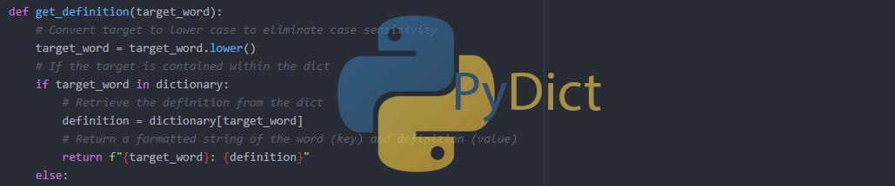

# Interactive-Dictionary  

This simple word finder functions like a dictionary and was built as a starter project towards the beginning of my Python practice.
Retrieves the Webster's definition for any word passed in. Also has the ability to suggest words in the case of mispelling.
